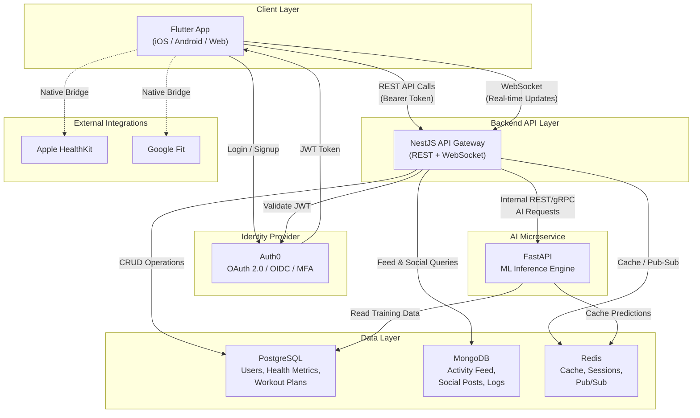

# High-Level Architecture Diagram

## System Overview

## Data Flow Summary

### Workout Data Flow
1. User logs a workout in the Flutter app.
2. Flutter sends the data to NestJS via REST API (authenticated with JWT).
3. NestJS validates the token with Auth0 and stores the workout in PostgreSQL.
4. NestJS publishes an event to Redis for real-time subscribers.
5. NestJS forwards the workout data to FastAPI for recommendation updates.

### Social / Activity Feed Flow
1. User creates a social post or achieves a milestone.
2. Flutter sends the post to NestJS.
3. NestJS stores the post in MongoDB (flexible schema for varied content types).
4. NestJS publishes a real-time notification via Redis Pub/Sub.
5. Connected clients receive the update through WebSocket.

### Nutrition Data Flow
1. User logs a meal in the Flutter app.
2. Flutter sends nutrition data to NestJS.
3. NestJS stores the entry in PostgreSQL (relational links to user profile).
4. NestJS requests a personalized meal suggestion from FastAPI.
5. FastAPI runs the ML model and returns recommendations via internal API.
