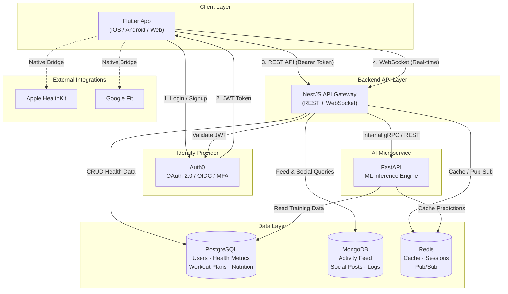

# High-Level Architecture Diagram

## System Overview



---

## Data Flow Details

### 1. Workout Data Flow

```
User logs workout
    → Flutter (REST POST /workouts)
    → NestJS validates JWT with Auth0
    → NestJS stores in PostgreSQL (workouts table)
    → NestJS publishes event to Redis Pub/Sub
    → NestJS calls FastAPI for recommendation update
    → FastAPI returns personalized plan
    → NestJS pushes update via WebSocket to Flutter
```

### 2. Social / Activity Feed Flow

```
User creates post or achieves milestone
    → Flutter (REST POST /feed)
    → NestJS stores document in MongoDB (flexible schema)
    → NestJS publishes notification to Redis Pub/Sub
    → Connected followers receive update via WebSocket
```

### 3. Nutrition Data Flow

```
User logs a meal
    → Flutter (REST POST /nutrition)
    → NestJS stores entry in PostgreSQL (nutrition_logs table)
    → NestJS calls FastAPI (POST /recommend/meal)
    → FastAPI runs ML model (reads user history from PostgreSQL)
    → FastAPI caches result in Redis (TTL: 1 hour)
    → FastAPI returns personalised meal suggestions
    → NestJS returns suggestions to Flutter
```

---

## Component Responsibilities

| Component | Responsibility |
|-----------|----------------|
| Flutter | Cross-platform UI, sensor data access, real-time updates |
| Auth0 | Identity management, JWT issuance, MFA |
| NestJS | Business logic, REST API, WebSocket gateway, orchestration |
| FastAPI | ML inference, recommendation engine, model serving |
| PostgreSQL | Transactional health data, user profiles, compliance store |
| MongoDB | Activity feed, social content, flexible schema events |
| Redis | Session cache, real-time pub/sub, short-lived caches |

---

## Security Architecture

- All client-to-server communication is over HTTPS / WSS (TLS 1.3).
- JWTs are short-lived (15 min) with refresh tokens (7 days, rotated).
- PostgreSQL uses Row-Level Security (RLS) to enforce per-user data isolation.
- Secrets are stored in environment variables (never in source control).
- Auth0 provides audit logs for HIPAA/GDPR compliance evidence.
